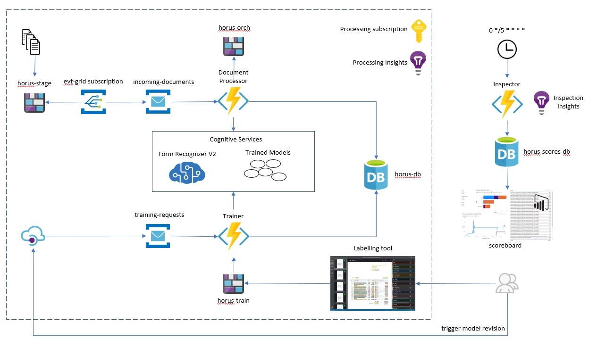

  

# Horus

Is a forms recognition engine based on Microsoft Azure.  In simple terms, horus enables you train a forms recognizer model based on some sample documents, and then use that model to process document images to translate the data they contain into structured data. This is very early documentation - expect it to evolve significantly over the coming months.

Horus can be used for the Horus challenge - where teams compete against each other the get the highest quality recognition from a standard set of documents, or it can be used simply as a jump start for your own processing.  Currently these instructions are written for the challenge - but if you are interested in getting started on your own documents ASAP, then please contact me **nickdothillatmicrosoft.com** and I'll let you know how to go it alone. 

If you'd like to give it a try see the [getting started guide](getting-started.md).

# Overview

There are three main workflows that comprise the whole Horus solution:

* Document Processing
* Model Training
* Inspection and Continuous Improvement

## Document Processing
This is the heart of the system.  Documents are uploaded to a staging storage account (horus-stage). You create a container per document format that you need to process. Any storage container created on this account is monitored by an Event Grid subscription (evt-grid subscription).  When a document is uploaded to any container the event grid fires and places a message describing the document onto a service bus queue (incoming documents).

This message will trigger the Document Processor function to pick up and process the uploaded document.  The document is renamed to include the storage container name (representing the document format).  This let's us handle files with the same name from different sources without overwriting.  The document is then moved to to the orchestration storage account (horus-orch).  Each instance of Document Processor is given a unique id (a guid) and all assets associated with the processing of a specific document are placed in this orchestration container for traceability.

The Document Processor is implemented as a series of Azure Durable Functions each of which has clearly defined responsibilities (and can be customised) but to keep things initially simple, the Document PRocessor identifies the correct trained model for the document format of the document that is being processed, and then sumits a recognition request to the Forms Recognizer Azure service.  When the recognition has been completed, the interim working files are saved to the orchestration container.  The json representation of the text in the document is then processed and the results saved to an Azure SQL database (horus-db).

## Model Training

Images of documents are processed using AI algorithms to identity the text embedded in the image,  In order to do this in the Document Processing workflow, a trained model is need for the document format that is being processed.In order to process a document.  Models are trained and registered in the system using the Model Trainng workflow.

A small number of sample documents (minimum 5) are uploaded manually to the trainng storage account (horus-train).  Once uploaded these images are tagged using the Form Recognizer Labelling tool (labelling tool).  This isa web application hosted in a docker container that lets you tag indiviudal items of data and give them a name and a data type.  These tags are stored in a labelling project.  Multiple documents and their subtle differences and slight variations in format are tagged and stored in a labelling project.

The labelling tool has an option to train the model based on the current state of the tags, and gives a series of quantative accuracy measurementss for each tag.  It also supports uploaded of a previously unseen document and recognising based on the current training model.  It is notmal to iterate throught his process to get a reasonably high accuracy in the recognition of previously unseen documents.

Whent he labeller is happy with the accuracy for a particular document format, they initate a model training request (trigger model revision).  This triggers a message describing the request to placed onto anouther service bus queue (training-requests).  This in turn triggers the Trainer function.  the trainer submitsa request to form recogniser to train a model based on the labelling (just as is done throught the labelling tool.  Once the model training is complete, the trainer then saves the current model Id in a versioned record for the document type in horus-db.

This means that in subsequent Document Processing workflows, the new document type is used to look up the latest model, and use that to run recognition for the document.

## Inspection

The inspection workflow is optional, and was developed to produce the data for the scoreboard used in the Horus challenge.  The inspector function is triggered every 5 minutes and looks at the state of the processing evironment awarding points for each stage of set-up and processing.  Results are written to the scores database (horus-scores-db). Where multiple teams are taking part simultaneously, the scoreboard gives a good appreciation of how much progress each team has made, and of the accuracy of recognition that their models are delivering.

Points are awarded for basic things - such as creating a container for training a model for a particular document format, for uploading samples and for tagging - but the majority of points relate to the accuracy of recognition of doucments.  Each document has a maximum of 100 points available if it recognized completely accurately - but this is rarely the case (at least initally).  In order to understand the accuracy all tests are logged to Application Insights (Inspection Insights) which will give a good feel for which fields in a documen are not being recognized correctly.  The documents in question can then be added to the training dataset by following the training workflow once again, and in this way accuracy can be continually imporved.

In the challenge, the team with the mos accurately recognized documents is the winner.

