# Create your first custom labelling project

When you use the Form Recognizer custom model, you provide your own training data so the model can [train to your industry-specific forms]{(https://docs.microsoft.com/en-us/azure/cognitive-services/form-recognizer/build-training-data-set}. If you're training without manual labels, you can use five filled-in forms, or an empty form (you must include the word "empty" in the file name) plus two filled-in forms. Even if you have enough filled-in forms, adding an empty form to your training data set can improve the accuracy of the model.

If you want to use manually labeled training data (which we do), you must start with at least five filled-in forms of the same type. You can still use unlabeled forms and an empty form in addition to the required data set.

The setup workflows have given you a jump start in Model Training.  The training storage account already has a container created for document format **abc**.  5 sample documents have been uploaded to that container, along with tag definiton files and tagging for each of the sample documents.

You'll need to create a labelling project (its not currently possible to automate this).  The instructions are as follows:

1. Identify the shared access signature for the **abc** container withing the training storage account. This *SASUrl* is created as part of the installation and is printed to the log at the end of the Processing Infrastruture github action.  Look in the logs to identify the Url.  If you are familar with this you could create another one using the portal or Azure Storage Explorer.
2. Download and run the labelling tool (linux) docker container:

&nbsp;&nbsp;&nbsp;&nbsp;&nbsp;&nbsp;&nbsp;`docker pull mcr.microsoft.com/azure-cognitive-services/custom-form/labeltool`

&nbsp;&nbsp;&nbsp;&nbsp;&nbsp;&nbsp;&nbsp;`docker run -it -p 3000:80 mcr.microsoft.com/azure-cognitive-services/custom-form/labeltool eula=accept`

3. Browse to http://localhost:3000

This should load the custom labelling tool.  

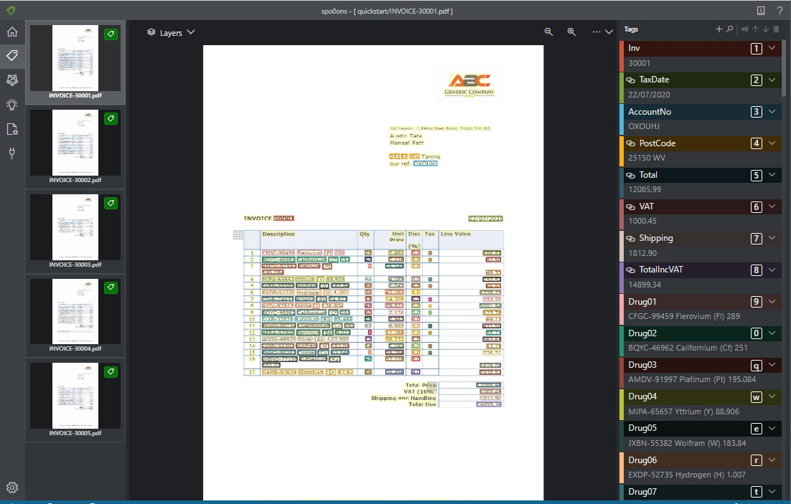

Follow the [instructions] (https://docs.microsoft.com/en-us/azure/cognitive-services/form-recognizer/quickstarts/label-tool#label-your-forms) to create a new project, but use the SasUrl identified in step 1 above when creating your connection.  Even though you are creating a new project this should do so including the pre-prepared assets that we deployed as part of set-up.  In this way you should be able to step strainght to the [train a custom model] (https://docs.microsoft.com/en-us/azure/cognitive-services/form-recognizer/quickstarts/label-tool#train-a-custom-model) and avoid most of the tagging legwork.

> In testing the SasUrl generated by the deployment has sometimes meant that the labelled documents arent loaded correctly.  In that case generate a new SasUrl for the training storage account container **abc** and use that instead.

At this stage you should have a screen in your labelling tool that looks like this:

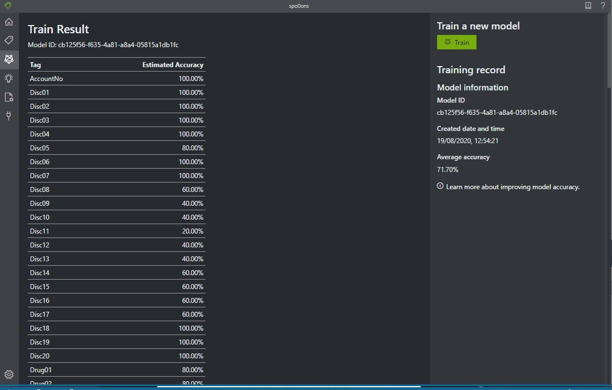

And it's time to submit a Training Request.

___you will also need to create custo labelling projects for the other two document formats (oscorp and neuryon)___

## Submit a Training Request

Submitting a training request triggers the [model training workflow](https://github.com/nikkh/Horus#model-training) in the horus application. The simplest way to submit a request is do so by sending an http POST message to the processing function app (app-func).  The function that triggers a training request is HttpTrainRequest. 

In order to send a request to an Azure funciton you need to send a security code as part of the request.  This code can be obtained from the Azure Portal as described in [this](https://docs.microsoft.com/en-us/azure/azure-functions/functions-bindings-http-webhook-trigger?tabs=csharp#obtaining-keys) document.

[This web application](https://jolly-mud-0b7c08503.azurestaticapps.net/) will let you make this request easily. You could also use Postman or similar to construct a body as follows:

````
{
  "SasUrl": "your SasUrl as in the custom labelling project above",
  "Items": [
    {
      "DocumentFormat": "abc",
      "BlobFolder": "quickstart"
    }
  ]
}
````

Post that body to the following url:

`https://app-func.azurewebsites.net/api/HttpTrainRequest?code="your function code"`

This will post a message onto the training-requests queue and cause a model to be trained based on the traaining assets in your training stroage account.  Once the model is successfully trained, a record is kept as control data in the application Sql DB and this newly trained model will be used for all subsequent document processing / recognition  for this document type (unless the model is retrained using another similar request).

## Submit some 'Previously Unseen' documents

Sample documents are stored in GitHub along with everything else.  Samples are present in the [Generator project](https://github.com/nikkh/Horus/tree/master/Horus.Generator/Documents).  There is a directory for each fictious supplier (abc, oscorp and neuryon).  Documents in the range 30001-30010 are intended as training documents (you can process them but you will not gain any scores for doing so) documents 30011 onwards unseen, you can upload them without the system ever having encountered them before and they should still be recognised.

Once your model has been trained for a particular document format, then you are ready to process some previously unseen documents.  These documents have not been used as part of the training cycle and can now be recognized and processed automatically, ven though they have never been seen before.  ___This is the essence of the value of Forms Recognizer___. You train a model for each type (format) of document that you recieve, and then all future documents of that type can be recognised automatically.

Let's get going.  You will remember from the description of resources that there is a staging storage account automatically created by the deployment. it should be called `app-random-stage`.  This strage account is monitored by an Event Grid subscription so whatever containers  you create, uploading a document into those containers will cause the subscription to fire and place message on the *incoming-documents* service bus queue.

The first thing that happens then is that the document is renamed to include the document format in the name.  In our case we are currently working with the *abc* format - so if we upload invoice1.pdf it will be renamed to abc-invoice1.pdf and it will be referenced thus for the rest of the workflow.

Ensure that there is a container called *abc* in the staging storage account.  Then (using [Storage Explorer](https://azure.microsoft.com/en-us/features/storage-explorer/) or Azure Portal), upload a document to the abc container.  After a few seconds the document should disappear - this is becasue it has been renamed and moved to the orchestration container for the workflow that is processing it.

After a minute or so, processing should have finished.  The simplest way to check this is to access the Sql databse using Sql Server Management Studio or your favourite tool.  The connection string for the processing database can be found int he app-func configuration.  Use this to access the database.  The documents table should now contain a record for the invoice that you uploaded.  Repeat with a couple of other of the same documents.

Scores will be updated after a maximum of 5 minutes.  if you check the scoreboard at this point you should see you have received some points for processing an unseen document:

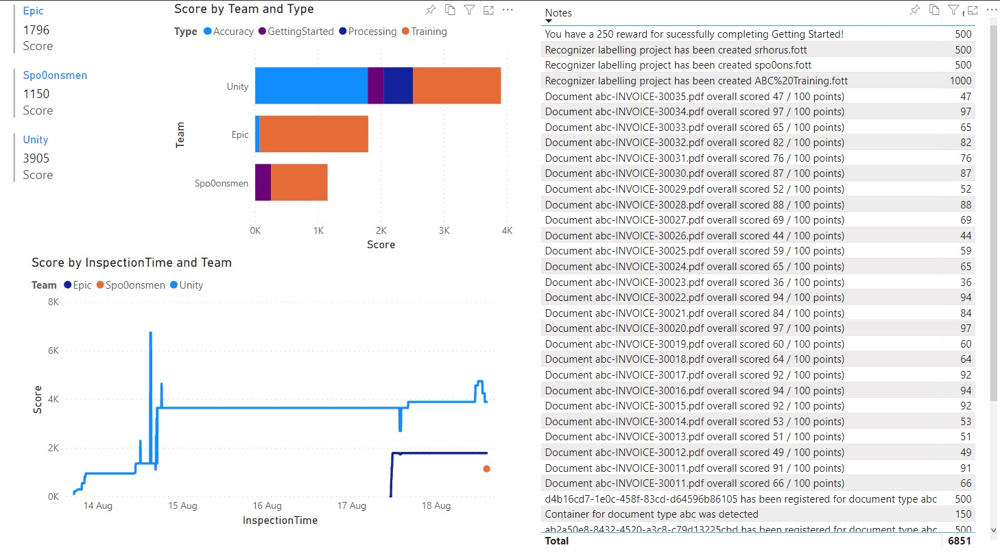

>Notice the hightlights documents on the scoreboard image - one has an accuracy of 97%, the other has 47%.  Why is this?  See the next section [Understanding what happened during the recognition process](https://github.com/nikkh/Horus/blob/master/help.md#understanding-what-happened-during-the-recognition-process) to learn more.

# Understanding what happened during the recognition process

There are a number of ways to understand what happened during recognition:

1. Look at the Document Errors in the database
2. Look at Application Insights for the processing run
3. Look at the Job Log for each individual processing run
4. Look at Application Insights for the scoreboard calculation (inspection)

Of there, items 1-3 are always available.  Item 4 is only available if you are taking part in a challenge or have deployed your own scorecard infrastructure.

Each of these options is breifly explained below:

## DocumentErrors Database Table

This is the most basic mechanism for inspecting the processing results.  During processing the processor function reaches into the json output of the forms recogniser to pull fields for storage in the database.  if a field isnt correctly recognized, then very often it doesnt appear in the json output.  Other times a muber is recognised as containing characters.  This errors are logged to the DocumentErrors table:

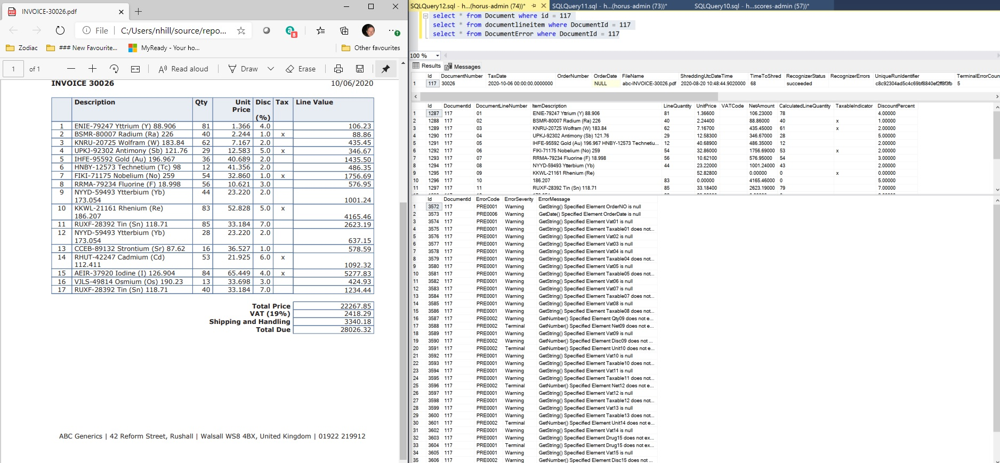

As can be seen from the above screenshot, a number of erros were encountered when processing the recognized json.  Many of these are flagged as warnings (for example the order number is null, but there is no order number on the input document so this can safely be ignored).  There are terminal errors too (for example element net09 does not exist int he recognized output).  Net09 is the price for line 9 - as can be seen line 9 is one of the lines where the product description wraps, could that be the reason?  Regardless we need to [improve recognition accuracy](https://github.com/nikkh/Horus/blob/master/help.md#improving-recognition-accuracy) here.

## Application Insights for Processing

___Need to introduce application insights correlation for durable tasks here...___

## Job Log

Every request to train a model or process a document is handled by a durable function.  Each execution instance of a durable function gets allocated a unique id.  All logs and interim assets that are used or produced by an instance are stored in a container within the app-random-orch storage account.  The following snip shows one of these orchestration containers:

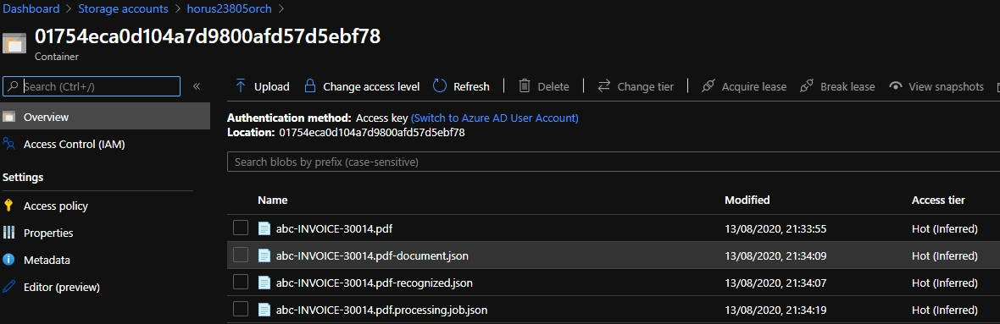

Each container stores the state for a single execution instance.  In this case the items are as follows:

* abc-INVOICE-30014.pdf: This is the unchanged raw file that was uploaded and processed
* abc-INVOICE-30014.pdf-document.json: This is a json representation of the document that was processed
* abc-INVOICE-30014.pdf-recognized.json: This is the output from the Form Recognizer
* abc-INVOICE-30014.pdf.processing.job.json: This is the interim working state of the process.

.job.json files are an audit train of parameters

## Application Insights for Inspection

By far the best way of understanding the accuracy of your document recognition is to query the Application Insights instance for the inspector component that calculates scores.  *The reason for this is that when documents are genrated for the challenge, expected results are written to the database - which means that every field can be checked for a partiular document run - and even slight errors in recognition are detected and logged*

The Application Insights instance will be called *app-inspect*.  If you use application insights search to identify the document you are interested in, then you can look at extensive detail as to how that document fared in recognition:

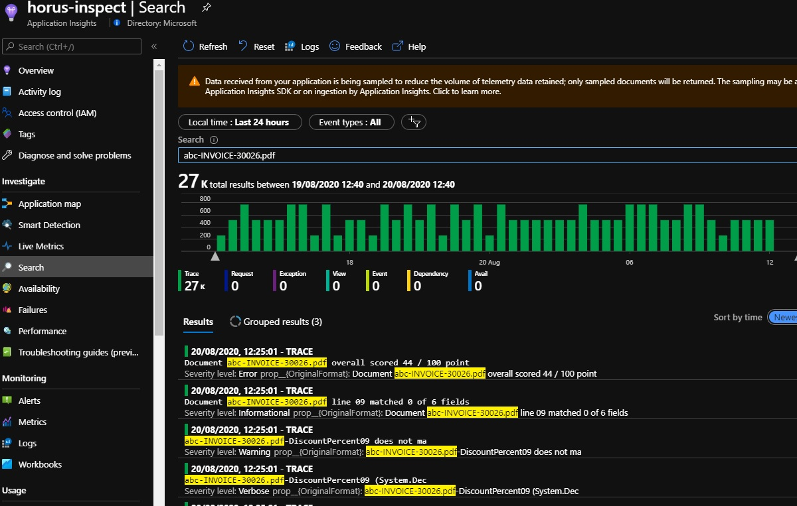

In this case abc-INVOICE-30026 scored only 44 / 100.  Why was that?  Which fields were not recognized correctly?  If you scroll down you can see a full list of fields that weren't recognized correctly - if you click on an indivdual record you will see more details.

# Improving Recognition Accuracy

We have noticed throughout that there are some problems with abc-INVOICE-30026.jpg.  Can we improve the accuracy?

Probably the most effective thing you can do to improve accuracy is to identify those documents that have a low accuracy score, and then use those to train the model.  Prior to specific labelling and training we had a score of 44 /100.

If we look at the invoice it has a few line items where the product description word wraps:

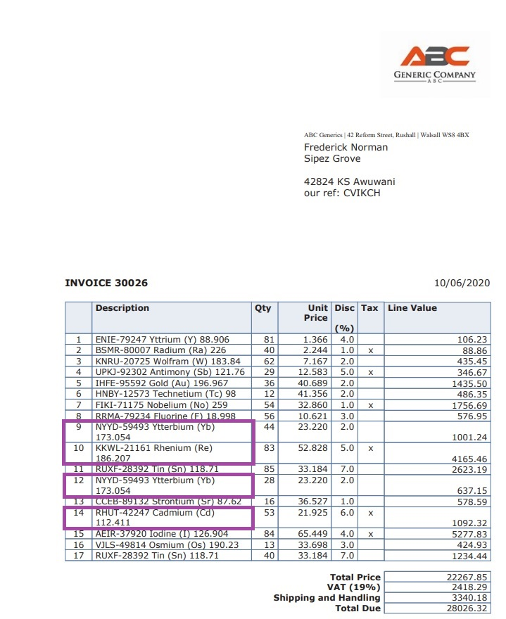

Once we retrain the model with labels specifically for this invoice then we get a significantly improved score for this invoice:

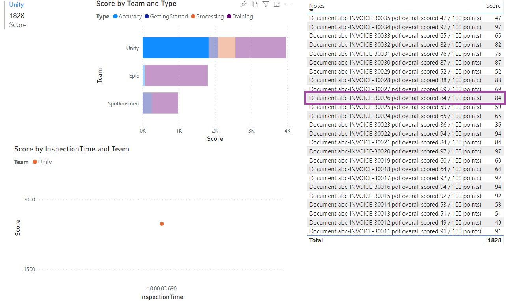

However, the newly trained model is now more 'intelligent', so not only can it dumbly interpet the labels we have assigned to invoice-30026 to improve accuracy from 44% to 84%, but this new knowledge can also be applied to other documents. If we re-run processing for all the ABC documents we should see an improvement in accuracy across the board:

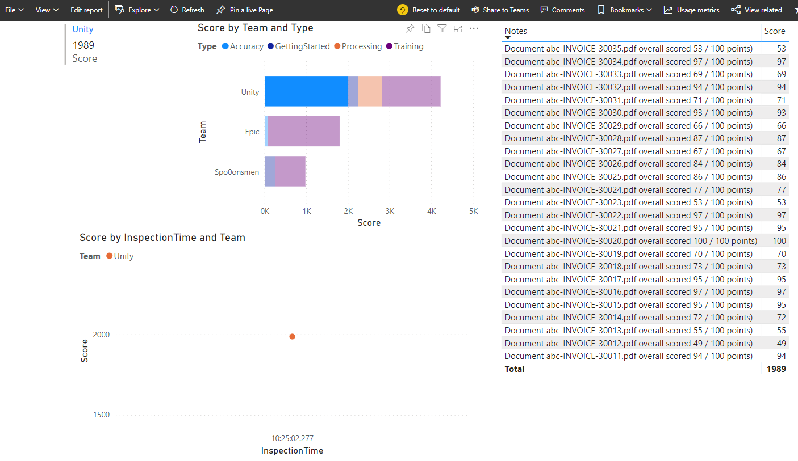

You can see from this that the overall score for accuracy across the abc document set has increased from 1828 to 1989.  Let's investigate what happened here.  

Let's drill down into 30030.  Prior to relabelling 30026 and retraining the model it had a score of 87, after this rose to 93.  

Here is a log analytics query (over the app-inspect application insights instance) that pulls out the logs for fields that dont match when processing this document:

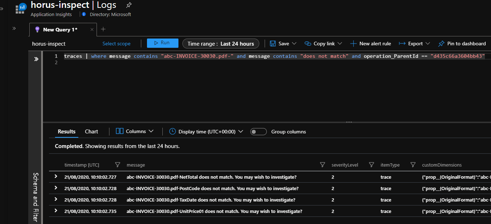

and here is the same query for the previous inspection run (prior to retraining the model with the tags from 30026):

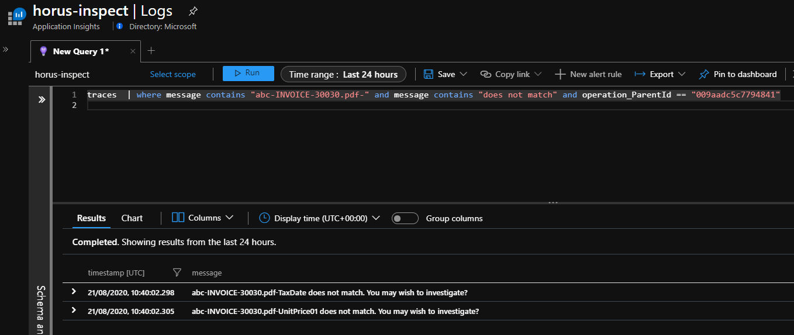

This is really quite startling. The improved form recognizer model is now able to correctly has been able to correctly identify NetPrice and Postcode.  

# Frequently Asked Questions

Review the [FAQ](faq.md)
